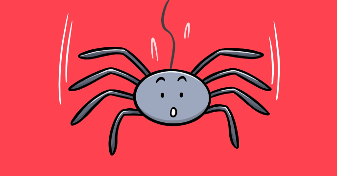

This program goes one step above “Retro sprite” and stores the sprite as binary information. There is no need to waste computer memory: one bit per sprite pixel is enough.

You’ll learn:

-	About binary numbers
-	How to convert a number to the binary representation
-	How to store a sprite as numbers
 
## Source code 
The JavaScript source code of this program can be found [here](sketches/program.js). To run it, you need to import it in the [codeguppy.com](https://codeguppy.com) online editor. Alternatively, you can use the source code in your p5.js sketches (advanced use). 
## Online version 
To see the code running, check the online playground at [https://codeguppy.com/code.html?t=sprite_spider](https://codeguppy.com/code.html?t=sprite_spider) 
## Next steps 
Please check [codeguppy.com](https://codeguppy.com) for many other fun JavaScript programs and games for beginners. To stay up to date with CodeGuppy development please follow [@codeguppy](https://twitter.com/codeguppy) on Twitter.  
